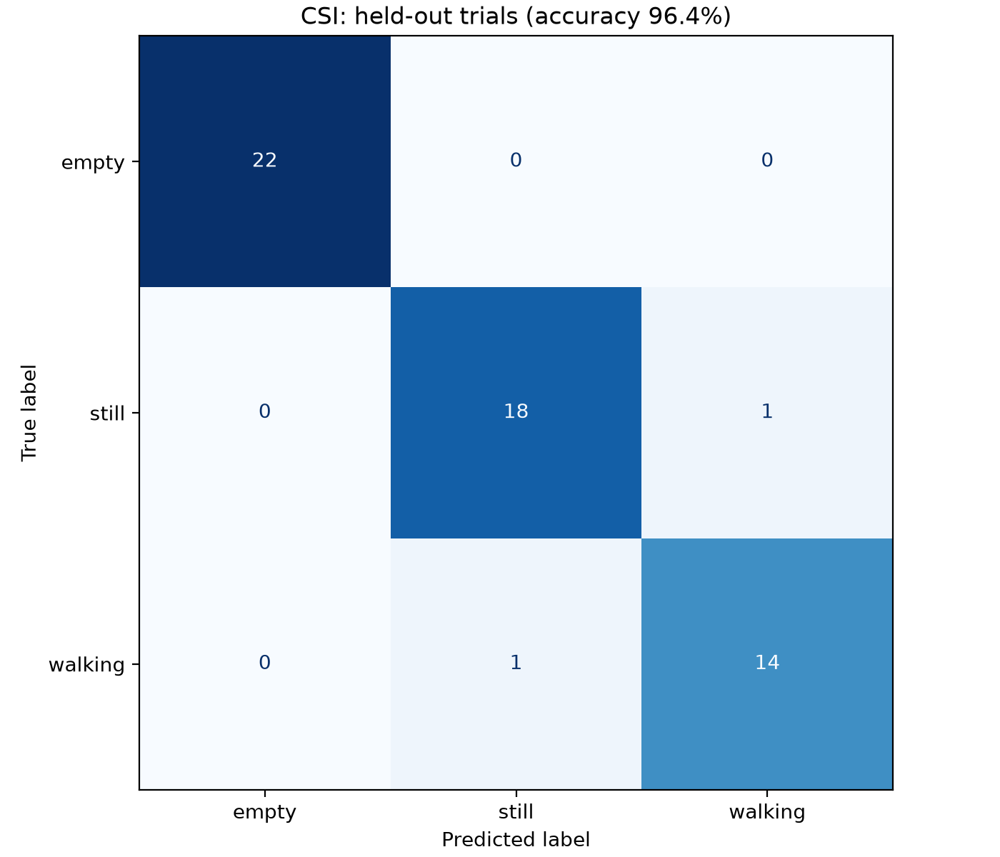

# Wi-Fi CSI Activity Sensing

A Wi-Fi Channel State Information (CSI) sensing project using ESP32-C5 hardware
and machine learning for device-free human activity classification.

## Current Capabilities

The current system classifies three conditions:

- Empty room
- Person standing still
- Person walking

## Baseline Results

- 29,996 valid CSI packets
- 15 total recorded trials
- 294 usable windows
- 12 training trials
- 3 held-out test trials
- 238 training windows
- 56 test windows
- Random Forest test accuracy: **96.43%**

The train/test split is performed by entire trial rather than by individual
windows, helping reduce leakage between training and test data.

## Confusion Matrix

## Hardware

- 2× ESP32-C5 development boards
- External dual-band Wi-Fi antennas
- Old laptop running Ubuntu 26.04.1 LTS

## Pipeline

ESP32-C5 TX
→ Wi-Fi channel
→ ESP32-C5 RX
→ CSI capture
→ preprocessing
→ feature extraction
→ Random Forest classifier

## Current Status

The first working prototype successfully captures CSI in real time and
distinguishes empty-room, stationary-person, and walking conditions.

## Limitations

The current baseline was trained and evaluated on a small dataset collected
in a single environment with a fixed transmitter/receiver arrangement.

Although testing was performed using entirely held-out trial files rather than
randomly splitting windows, the reported 96.43% accuracy should be treated as
an initial baseline rather than evidence of cross-room or cross-user
generalization.

Future testing will evaluate performance across different sensor positions,
room layouts, subjects, walking directions, and environmental conditions.

Next steps:

- Testing generalization across different TX/RX positions
- Testing different walking directions and speeds
- expand to multi-node sensing(three or four boards) if additional spatial coverage is needed
- Real-time inference
- Comparing Random Forest with neural network models

## Third-Party Software

This project uses Espressif ESP-CSI and ESP-IDF.

ESP-CSI:
https://github.com/espressif/esp-csi

ESP-IDF:
https://github.com/espressif/esp-idf

Third-party code remains subject to its original license.
